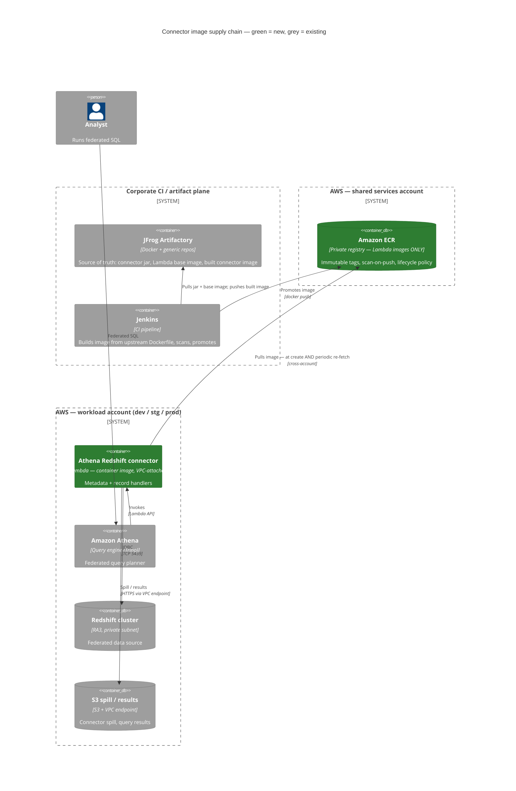

# ADR-0001: Amazon ECR as the image registry for Lambda, with JFrog as source of truth

**Date**: 2026-07-11
**Status**: proposed
**Deciders**: VB (proposed — pending team review)

## Context

Athena Query Federation connectors deploy as Lambda functions. The Redshift connector cannot be deployed as a `.zip`/jar: `athena-redshift-2026.24.1.jar` unzips to **275,595,798 bytes**, against Lambda's hard **250 MiB (262,144,000 byte)** limit on *unzipped* package size. This was verified with `unzip -l`, not inferred. Container images have no such limit (10 GB uncompressed), which is why AWS's own SAR template for this connector ships `PackageType: Image`.

Lambda pulls container images from **Amazon ECR only** — third-party registries are not supported ([Lambda docs](https://docs.aws.amazon.com/lambda/latest/dg/images-create.html): *"The Amazon ECR repository must be in the same AWS Region as the Lambda function"*). JFrog therefore **cannot** be the runtime registry for these images, no matter how it is configured. Meanwhile AWS publishes the pre-built connector image in an AWS-owned account (`292517598671`) that our egress policy does not permit.

Two constraints are therefore in tension: Lambda requires ECR, and our standard is that JFrog is the source of truth for all artifacts. This ADR resolves that tension.

For reference, the other connectors clear the zip limit but not comfortably — MySQL unzips to 245,459,306 bytes (~4.6 MB of headroom) and DynamoDB to 239,233,463 bytes. A future connector version could push either over.

## Decision

We adopt **Amazon ECR strictly as Lambda's image-pull mechanism, not as an artifact store**. JFrog remains the source of truth and the promotion gate for all artifacts, including these images.

Concretely:

1. **Jenkins builds the connector image in-house** from the connector repo's own unmodified `Dockerfile`, sourcing both the connector jar and the `public.ecr.aws/lambda/java:21` base image from JFrog. AWS's ECR account (`292517598671`) is never contacted.
2. The built image is pushed to **JFrog Docker (source of truth, scanning, promotion gates)**, then **promoted into a central shared-services ECR account**.
3. Workload accounts (dev/stg/prod) **pull cross-account** from that central ECR account, per region.
4. ECR repositories are namespaced `athena-federation/*`, carry **immutable tags**, **scan-on-push**, and a **keep-last-N + expire-untagged** lifecycle policy.

## Architecture

**Green = introduced by this decision. Grey = already exists.**

## Alternatives Considered

### Alternative 1: Deploy the connector as a jar (zip package), as we do for other Lambdas
- **Pros**: No ECR, no container pipeline, no new infrastructure. Consistent with our existing Lambda deployments.
- **Cons**: —
- **Why not**: **Physically impossible.** 275,595,798 bytes unzipped against a 262,144,000 byte hard limit. No configuration, S3-sourced upload, or compression changes this. Not a trade-off — a wall.

### Alternative 2: Use JFrog as the registry Lambda pulls from
- **Pros**: Zero new AWS surface; JFrog stays the only registry; perfectly aligned with our artifact standard.
- **Cons**: —
- **Why not**: **Lambda does not support it.** Container images must come from Amazon ECR; third-party registries are not a supported source. This was the preferred option and had to be abandoned on a hard product constraint.

### Alternative 3: Pull AWS's pre-built image directly from AWS's ECR account (`292517598671`)
- **Pros**: Zero build pipeline to own. Bit-for-bit the artifact AWS ships and tests.
- **Cons**: Requires egress to a third-party AWS account; the image never passes through JFrog, so it is unscanned, unpromoted, and has no provenance record in our supply chain; that account's repo policy grants only pull actions, so we cannot even introspect it (`ecr:DescribeImages` returns `AccessDenied`).
- **Why not**: Blocked by our egress policy, and it bypasses JFrog as source of truth — the exact control this ADR exists to preserve.

### Alternative 4: Mirror AWS's pre-built image through JFrog, then promote to ECR
- **Pros**: Exactly the artifact AWS ships, while still passing through JFrog for scanning and promotion. No Dockerfile or build to maintain.
- **Cons**: Still needs one-time egress to AWS's ECR account to seed **each new connector version** — the same blocked path, just less often. Adds a recurring exception request to every upgrade.
- **Why not**: Does not remove the dependency on the blocked registry, only reduces its frequency. Rejected for now; **worth revisiting** if that egress is ever permitted, as it removes our build-drift risk entirely.

### Alternative 5: Offload dependencies into a Lambda layer to get the jar under the limit
- **Pros**: Would preserve zip-based deployment.
- **Cons**: —
- **Why not**: The 250 MiB limit applies to **function code plus layers combined**. Layers relocate bytes; they do not create headroom.

### Alternative 6: Slim the jar (e.g. the `redshift-jdbc42-no-awssdk` driver variant, `minimizeJar` shading)
- **Pros**: Could plausibly get under 250 MiB and keep the zip path.
- **Cons**: Forks the upstream Maven build; we own the dependency-exclusion set forever and re-validate it on every connector upgrade; a wrong exclusion fails at runtime inside a Lambda, not at build time.
- **Why not**: Ongoing maintenance burden and a fragile failure mode, in exchange for avoiding a container pipeline we can otherwise build once. Poor trade.

## Consequences

### Positive
- Redshift federation becomes possible at all — there is no other route.
- **JFrog remains the source of truth.** Every image is built from JFrog inputs, scanned in JFrog, and promoted from JFrog. ECR holds only a promoted replica.
- **Full provenance.** We build from an unmodified upstream `Dockerfile` with a pinned connector version, so we can attest what is in the image — better than the pre-built artifact, which we could not even inspect.
- Works with egress fully locked down: AWS's ECR account is never contacted.
- The pipeline generalises. Any future connector (or any oversized Lambda) reuses it unchanged.

### Negative
- **A new AWS service enters our supported surface.** ECR must be provisioned, permissioned, monitored, and paid for, and the team must learn its failure modes.
- We own a container build we did not previously own: the base-image mirror, the Dockerfile pin, and the `JAVA_VERSION=21` build-arg override (the upstream Dockerfile defaults to 11).
- **Two registries now exist.** This creates a standing risk of ECR scope creep — see Risks.
- Cross-account pull requires policy on **both** sides (repository policy *and* the consuming role's identity policy), which is more moving parts than same-account.
- Image storage cost: these images are ~1 GB+ each, multiplied by retained versions and regions.

### Risks

- **A lifecycle policy expires an image that a deployed Lambda still references → the function enters `Failed` and *every invocation fails*.** This is the highest-severity risk here and it is non-obvious: Lambda re-fetches the image from ECR **periodically** (to re-optimize after idle), not only at create time. *Mitigation*: immutable tags; `keep last N` with a generous N (≥10); treat any ECR image deletion as a breaking change requiring a check that no deployed function references the tag.
- **The base image (`public.ecr.aws/lambda/java:21`) is itself unreachable.** ECR *Public* is a different service from the private registry we are blocking, and is often permitted — but not guaranteed. *Mitigation*: a JFrog remote Docker repository proxying `public.ecr.aws`. **Open point — must be confirmed before the first build.**
- **Our in-house image drifts from AWS's official one**, producing a connector that behaves subtly differently from the tested artifact. *Mitigation*: build from the upstream `Dockerfile` unmodified, pin the connector version, record the resulting digest in the release record.
- **Cross-account pull misconfiguration** leaves functions stuck `Pending`/`Failed` with an opaque error. *Mitigation*: prove the policy pair in dev before promoting; cross-account requires both sides, unlike same-account.
- **ECR scope creep** — it becomes a convenient general-purpose registry, quietly displacing JFrog as source of truth. *Mitigation*: see the constraint below; enforce by naming convention and SCP.

## Security and Access Control

**Scope constraint (the load-bearing rule):** ECR is **only** for Lambda container images, namespaced `athena-federation/*`. It is not an artifact store, not a general Docker registry, and nothing may be deployed *from* it that is not a Lambda function. JFrog remains the source of truth for everything. Enforce with an SCP and repository naming convention; treat any new ECR repo outside that namespace as requiring its own ADR.

**Push — CI only.**
- Only the Jenkins CI role may push: `ecr:GetAuthorizationToken`, `BatchCheckLayerAvailability`, `InitiateLayerUpload`, `UploadLayerPart`, `CompleteLayerUpload`, `PutImage`.
- **No human and no laptop pushes to ECR.** Images enter ECR only via promotion from JFrog.
- CI is **not** granted `ecr:BatchDeleteImage`. Deletion is the lifecycle policy's job alone (see the `Failed`-state risk above).

**Pull — cross-account, both sides required.**
- Repository policy in the shared account grants each workload account:
  - `CrossAccountPermission` — the workload account root, for `ecr:BatchGetImage` + `ecr:GetDownloadUrlForLayer`, so it can create/update functions from the image.
  - `LambdaECRImageCrossAccountRetrievalPolicy` — the `lambda.amazonaws.com` service principal, same two actions, conditioned on `aws:sourceArn` matching that account's function ARNs. **This one is required for the periodic re-fetch**; omitting it produces a function that deploys fine and then fails weeks later.
- The role in the workload account that creates the function needs `ecr:BatchGetImage` + `ecr:GetDownloadUrlForLayer` in its **identity** policy. (Same-account access would need only one side; cross-account needs both.)

**Data protection.**
- Encryption at rest enabled (KMS CMK preferred over the AES256 default, for key custody and auditability).
- `scanOnPush=true`; Inspector enhanced scanning where available. Findings gate promotion **in JFrog**, before the image reaches ECR — ECR scanning is a backstop, not the primary gate.
- The connector's runtime IAM role is unaffected by this decision: image-pull permissions are separate from what the function may do once running.
- Image signing (cosign / Notation) is **not** in scope here — noted as a candidate follow-up ADR.

## Lifecycle Management

**Tagging.**
- `imageTagMutability = IMMUTABLE`. Tag `2026.24.1` can never be silently repointed at different bytes — critical when Lambda re-fetches an image it already deployed.
- Tags mirror the upstream connector version exactly. No `latest`, ever.

**Retention.**
- Expire untagged images after 7 days (build debris).
- Keep the last **10** tagged images per repository.
- N=10 is deliberately generous: the cost of over-retaining is a few GB of storage; the cost of under-retaining is a production Lambda in `Failed` state.

**Upgrade path.**
1. Jenkins builds the new connector version → new immutable tag.
2. Promote through JFrog → push to ECR.
3. `aws lambda update-function-code --image-uri <repo>:<new-tag>` per environment.
4. The previous tag stays in ECR (covered by keep-last-10) so a rollback is a single `update-function-code` back to it.

**Regions.** Lambda requires the image to be in the **same region as the function**, so a multi-region rollout means one ECR repository per region, each receiving the promotion. Single-region today; noted so it does not surprise us later.

## Open Points

1. Is `public.ecr.aws` (ECR **Public** — distinct from the private registry we are blocking) reachable from Jenkins agents? If not, a JFrog remote Docker repo proxying it is a prerequisite for the first build.
2. Do Jenkins agents have a Docker daemon (or Kaniko/Buildah) available for image builds?
3. Which account is the shared-services ECR account, and does it already exist?
4. Confirm `keep last 10` against the actual release cadence once known.
